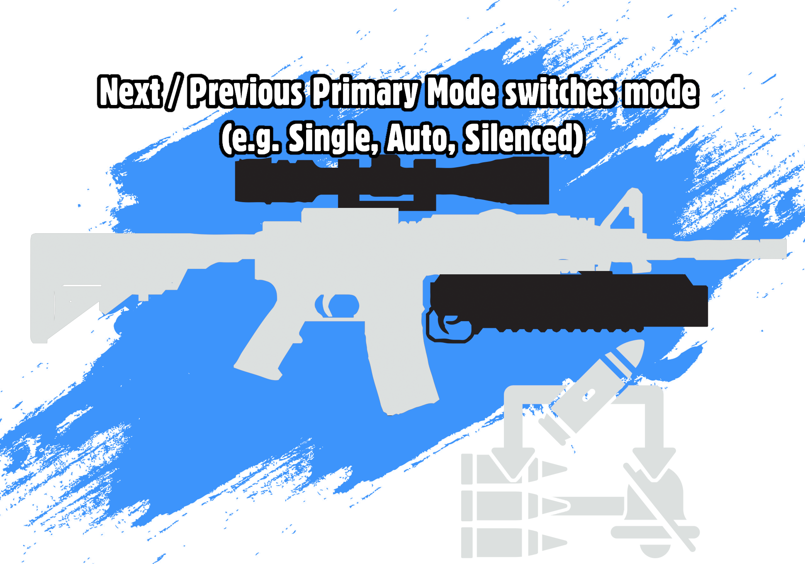

Create variant ammunition types and switch them on the fly. Also allows you to adjust your scope type and zoom, use a range of alternate fire modes, or even equip secondary weapons like under-barrel grenade launchers.

## Introduction

Build an ammunition workbench and some ammo variants,
then either set the hotkeys using the **Loads v2** [MCM menu](https://www.nexusmods.com/fallout4/mods/21497) or build hotkey items there.
See the [Getting Started guide](Docs/Loads_v2/User/index.md) if you want full instructions!

## Controls

There's also hotkeys to equip ammo variants with certain qualities, e.g. anti-armour or long-range, if you have them in your inventory.

Primary modes vary wildly by weapon - for regular ballistic guns it's usually silencers and automatic modes, but energy weapons can even turn on/off shotgun modes or charged attacks.

## Modding

If you want to use this framework to add your own ammo calibres, ammo variants, new secondary weapons, scope types or firing modes [check out the modding guide](Docs/Loads_v2/Modding/index.md).
